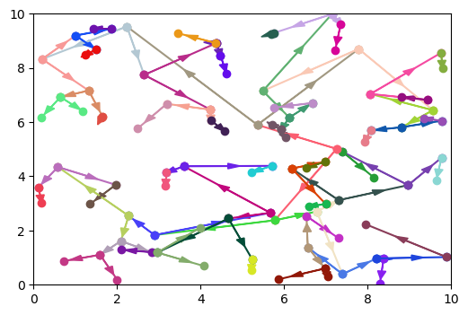

## k近邻 -- k-nearest neighbor k-NN

kNN是一种基本分类和回归方法。不具备显式的学习过程。

### k近邻算法

> 输入：训练集 $T = {(x_1,y_1),\cdots,(x_N,y_N)}$
>
> 输出：实例 $x$ 所属的类 $y$
>
> 1. 根据给定的距离度量，找出距离最邻近的 $k$ 个点，涵盖这 $k$ 个点的 $x$ 的邻域记作 $N_k(x)$
>
> 2. 在 $N_k(x)$ 中根据分类决策规则（如多数表决）决定 $x$ 的类别 $y$
>    $$
>    arg\max_{c_j}\sum_{x_i\in{N_k(x)}}I(y_i=c_j),i=1,2,\cdots,N;j=1,2,\cdots,K
>    $$
>    $k=1$时为最近邻算法。

## k近邻模型

模型的三个基本要素 ——距离度量、k值的选择和分类决策规则的决定。

### 距离度量

特征空间中的两个实例点的距离是两个实例点相似程度的反应。
$$
L_p(x_i,x_j) = \big(\sum_{l=1}^{n}|x_i^{(l)}-x_j^{(l)}|^p\big)^{\frac{1}{p}}
$$
$p=2$，成为欧式距离；$p=1$，称为曼哈顿距离；$p=\infty$，是各个坐标距离的最大值。

### k值的选择

应用中，k值一般取一个比较小的数值。通常采用交叉验证法来选取最优的k值。

### 分类决策规则

多数表决规则（majority voting rule）有如下解释：如果分类的损失函数为0-1损失函数，那么误分类的概率是：
$$
P(Y\neq f(X)) = 1-P(Y=f(X))
$$
对给定的实例 $x$，其最近邻的k和训练实例点构成集合$N_k(x)$。如果涵盖$N_k(x)$的区域的类别是$c_j$，那么误分类率是
$$
\frac{1}{k}\sum_{x_i\in{N_k(x)}}I(y_i\neq c_j) = 1-\frac{1}{k}\sum_{x_i\in{N_k(x)}}I(y_i= c_j)
$$
要使误分类率最小即经验奉献最小，就要使$\sum_{x_i\in{N_k(x)}}I(y_i= c_j)$最大，所以多数表决规则等价于经验风险最小化。

## kd树

kd树是一种对k维空间中的实例点进行存储以便对其进行快速检索的树形数据结构。kd数是二叉树，表示对k维空间的一个划分（partition）。

### 构造kd树

> 算法：构造平衡kd树
>
> 输入：k维空间数据集T
>
> 输出：kd树
>
> 1. 开始：构造根结点，选择$x^{(1)}$为坐标轴，以T中所有实例的$x^{(1)}$坐标的中位数为切分点，将根结点对应的超矩形区域切分为两个子区域。切分由通过切分点并与坐标轴$x^{(1)}$垂直的超平面实现。
>
>    由根结点生成深度为1的左、右结点。将落在切分超平面上的实例点保存在根结点。
>
> 2. 重复，对深度为j的结点，选择$x^{(l)}$为切分的坐标轴，$l=j(mod\ k)+1$。由该结点生成深度为j+1的左右子结点。将落在切分超平面上的实例点保存在结点。
>
> 3. 直到两个子区域没有实例点存在时停止。从而形成kd树的区域划分。

### 搜索kd树

> 算法：用kd树进行最近邻搜索
>
> 输入：已构造的kd树，目标点x
>
> 输出：x的最近邻
>
> 1. 在kd树中找出包含目标点x的叶节点：从根节点出发，递归地向下访问kd树。如果目标前x的当前维的坐标小于切分点的坐标，移动到左子节点，否则，移动到右子节点。直到子节点为叶节点为止。
> 2. 以此叶节点为“当前最近点”。
> 3. 递归的向上回退，在每个节点进行以下操作：
>    1. 如果该节点保存的实例点比当前最近距离小，则更新“当前最近点”
>    2. 当前最近点一定存在于该节点一个子节点对应的区域。检查该子节点的父节点的另一子节点对应的区域是否有更近的点。有就更新“当前最近点”。没有就向上回退。
> 4. 回到根节点时，结束搜索。当前最近点即x的最近邻点。

### python实现

```python
import numpy as np
import matplotlib.pyplot as plt
class kdTree:
    def __init__(self, parent_node):
        self.nodedata = None
        self.split = None
        self.range = None
        self.left = None
        self.right = None
        self.parent = parent_node
        self.leftdata = None
        self.rightdata = None
        self.isinvited = False
        
    def print(self):
        print(self.nodedata, self.split, self.range)
        
    def getSplitAxis(self, all_data):
        # 获取切分维度 -- 根据方差决定分割维度
        val_all_data = np.var(all_data, axis=0)
        if val_all_data[0] > val_all_data[1]:
            return 0
        else:
            return 1
        
    def getRange(self, split_axis, all_data):
        # 获取切分中值
        split_all_data = all_data[:, split_axis]
        data_count = split_all_data.shape[0]
        med_index = int(data_count/2)
        sort_split_all_data = np.sort(split_all_data)
        range_data = sort_split_all_data[med_index]
        return range_data
    
    def getNodeLeftRightData(self, all_data):
        # 获取左右节点包含的数据
        data_count = all_data.shape[0]
        ls_leftdata = []
        ls_rightdata = []
        for i in range(data_count):
            now_data = all_data[i]
            if now_data[self.split] < self.range:
                ls_leftdata.append(now_data)
            elif now_data[self.split]==self.range and self.nodedata == None:
                self.nodedata = now_data
            else:
                ls_rightdata.append(now_data)
        self.leftdata = np.array(ls_leftdata)
        self.rightdata = np.array(ls_rightdata)
        
    def createNextNode(self, all_data):
        # 递归生成树
        if all_data.shape[0]==0:
            print('create kd tree finished!')
            return None
        self.split = self.getSplitAxis(all_data)
        self.range = self.getRange(self.split,all_data)
        self.getNodeLeftRightData(all_data)
        if self.leftdata.shape[0]!=0:
            self.left = kdTree(self)
            self.left.createNextNode(self.leftdata)
        if self.rightdata.shape[0]!=0:
            self.right = kdTree(self)
            self.right.createNextNode(self.rightdata)
            
    def plotKdTree(self):
        # 绘制kdtree
        if self.parent == None:
            plt.figure(dpi=100)
            plt.xlim([0,10])
            plt.ylim([0,10])
        color = np.random.random(3)
        if self.left != None:
            plt.plot([self.nodedata[0], self.left.nodedata[0]],[self.nodedata[1], self.left.nodedata[1]], '-o', color=color)
            plt.arrow(x=self.nodedata[0], y=self.nodedata[1], dx=(self.left.nodedata[0]-self.nodedata[0])/2.0, dy=(self.left.nodedata[1]-self.nodedata[1])/2.0, color=color, head_width=0.2)
            self.left.plotKdTree()
        if self.right != None:
            plt.plot([self.nodedata[0], self.right.nodedata[0]],[self.nodedata[1], self.right.nodedata[1]], '-o', color=color)
            plt.arrow(x=self.nodedata[0], y=self.nodedata[1], dx=(self.right.nodedata[0]-self.nodedata[0])/2.0, dy=(self.right.nodedata[1]-self.nodedata[1])/2.0, color=color, head_width=0.2)
            self.right.plotKdTree()
            
    def divDataToLeftOrRight(self, find_data):
        # 确定搜索值左右查找
        data_value = find_data[self.split]
        if data_value < self.range:
            return 0
        else:
            return 1
        
    def getSearchPath(self, ls_path, find_data):
        # 获取根节点到包含目标点的节点路径
        now_node = ls_path[-1]
        if now_node == None:
            return ls_path
        now_split = now_node.divDataToLeftOrRight(find_data)
        if now_split == 0:
            next_node = now_node.left
        else:
            next_node = now_node.right
        while(next_node!=None):
            ls_path.append(next_node)
            next_split = next_node.divDataToLeftOrRight(find_data)
            if next_split == 0:
                next_node = next_node.left
            else:
                next_node = next_node.right
        return ls_path
    
    def getNNode(self, find_data, min_dist, min_data):
        # 搜索最近邻点
        ls_path = []
        ls_path.append(self)
        self.getSearchPath(ls_path,find_data)
        now_node = ls_path.pop()
        now_node.isinvited = True
        min_data = now_node.nodedata
        min_dist = np.linalg.norm(find_data-min_data)
        while(len(ls_path)!=0):
            back_node = ls_path.pop()
            if back_node.isinvited == True:
                continue
            else:
                back_node.isinvited = True
            back_dist = np.linalg.norm(find_data-back_node.nodedata)
            if back_dist < min_dist:
                min_data = back_node.nodedata
                min_dist = back_dist
            if np.abs(find_data[back_node.split]-back_node.range) < min_dist:
                ls_path.append(back_node)
                if back_node.left.isinvited==True:
                    if back_node.right == None:
                        continue
                    ls_path.append(back_node.right)
                else:
                    if back_node.left==None:
                        continue
                    ls_path.append(back_node.left)
                ls_path = back_node.getSearchPath(ls_path, find_data)
                now_node = ls_path.pop()
                now_node.isinvited = True
                now_dist = np.linalg.norm(find_data-now_node.nodedata)
                if now_dist < min_dist:
                    min_data = now_node.nodedata
                    min_dist = now_dist
        print(f"min distance:{min_dist} min data:{min_data}")
        return min_dist,min_data
         
    def getNNDistByEx(self, test_array, find_data, min_dist, min_data):
        data_count = test_array.shape[0]
        min_data = test_array[0]
        min_dist = np.linalg.norm(find_data-min_data)
        for i in range(data_count):
            now_data = test_array[i]
            now_dist = np.linalg.norm(find_data-now_data)
            if now_dist < min_dist:
                min_data = now_data
                min_dist = now_dist
        print(f"min distance:{min_dist} min data:{min_data}")
        return min_dist
    
    def plotScatter(self, test_array,find_data, min_dist, min_data):
        _,nndata = self.getNNode(find_data, min_dist, min_data)
        print(nndata)
        plt.scatter(test_array[:,0],test_array[:,1])
        plt.scatter(find_data[0],find_data[1], marker = '*')
        plt.scatter(nndata[0],nndata[1], marker='+')
seed = np.random.RandomState(0)
test_array = 10.0*seed.random([30,2])
my_kd_tree = kdTree(None)
my_kd_tree.createNextNode(test_array)
my_kd_tree.plotKdTree()   # 绘制kd树路径
find_data = np.array([5.0, 5.0])         
min_dist = 0                            
min_data = np.array([0.0, 0.0])             
# %time min_dist = my_kd_tree.getNNode(find_data, min_dist, min_data)      
# %time min_dist = my_kd_tree.getNNDistByEx(test_array, find_data, min_dist, min_data)  
my_kd_tree.plotScatter(test_array,find_data, min_dist, min_data) # 绘制最近邻
```




## Ref

1. http://t.csdn.cn/CGm7T
1. https://www.cnblogs.com/eyeszjwang/articles/2429382.html
